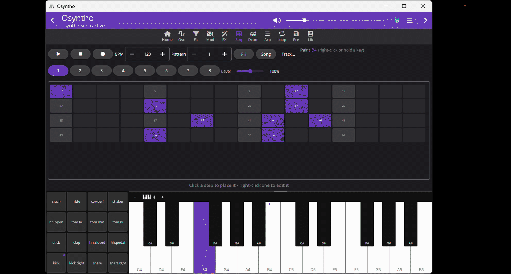
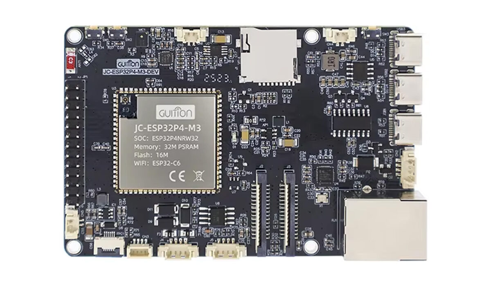
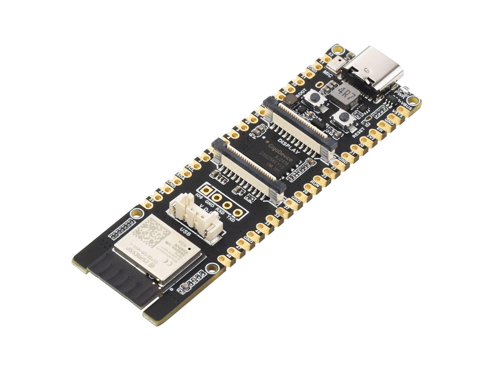

# osynth

**A full groovebox on a microcontroller.** Six synth engines, a real sampled
drum kit, an 8-track multitrack sequencer, an 8-track looper and a stereo
audio input — running on an ESP32-P4, an ESP32-S3 (or a classic ESP32) and
played from your phone (or Windows, Mac, Linux) over Bluetooth.

```
  6 engines · 8 voices · 14 effects · 8×256-step sequencer
  16-slot drum kit · 8-track looper max 160s · line + mic in
  USB audio + MIDI · USB MIDI host · BLE app
  everything persists · powers on where you left off
  …or run the whole thing inside the app, with no board at all
```

Again. **Or run the whole thing inside the app, with no board at all.** Like a vst instrument, but a standalone app instead.



---

## What it does

### 🎹 Six synth engines, hot-swappable

| Engine | What it is |
| --- | --- |
| **Subtractive** | 2 PolyBLEP oscillators + noise → the filter family below. The classic. |
| **FM** | 2-operator × 2 phase modulation, per-pair index envelopes and feedback. DX-style e-pianos, bells, growling basses. |
| **Wavetable** | 4 morphing table sets × 8 frames × 8 band-limited mips — basic, hard-sync, vocal formants, FM. No aliasing by construction. |
| **Additive** | 16 sine partials with drawbars, spectral tilt, even/odd balance and inharmonicity. A filter sweep with no filter — and now a filter on top of it. |
| **Granular** | A cloud of short windowed grains per voice, scheduled sample-accurately. Grains hold either an oscillator burst — FOF/pulsar synthesis, where the grain *rate* carries the pitch and the grain's own frequency is a formant that moves independently of it — or a window onto the **audio input**, transposed by the key, scattered, played backwards, or frozen into a fixed sample. |
| **Modular** | Not a fixed chain at all: a 12-node graph you patch with cables in the app. Oscillators, noise, every filter topology, VCAs, mixers, shapers, ring mod, envelopes, LFOs, sample-and-hold, MIDI sources and the line input. |

Switch engines mid-chord — the voice bus fades over ~10 ms, so it never
clicks and never leaves a note stuck.

The modular engine is compiled, not interpreted: an accepted edit runs a
cycle check, a topological sort, live-range buffer reuse and in-place
rewriting on the control task, and the audio task renders a flat plan.
Orphaned nodes are dropped, control-rate nodes cost one float per block
instead of one per sample, and a **cost budget** prices the patch before you
hear it — which is why each heavy filter topology is its own node kind
rather than a `type` knob inside one.

### 🎛️ One filter family, everywhere

Five topologies — **12 dB SVF**, **24 dB** (Butterworth Q pair, not two
squared stages), **Moog ladder** with saturated feedback, **dual/spread**
(a bandpass whose width is a knob instead of a side effect of Q), and a
**three-formant vowel** filter morphing a–e–i–o–u — across seven responses
(lowpass, bandpass, highpass, notch, peak, allpass, normalized bandpass),
with a **drive** that saturates the resonant integrator rather than just
the output.

Every fixed engine has one, and the modular graph gets each heavy topology
as its own node, so the patch budget can price it honestly. And the master FX
bus has one too — the only filter here that reaches the drums and the
looper, which is what makes a whole-track build-up possible. Every one of
them has an on/off switch that skips the work when it is off.

### 🥁 A drum kit that sounds like drums

16 slots of **real recorded percussion**, converted to mu-law at per-slot
sample rates and linked into the firmware as `.rodata` — flash-mapped, so the
whole kit costs **zero RAM**. Per-slot level, pan, tune and decay; choke
groups for hi-hats; a General-MIDI note map. PSRAM boards can load extra kits
from an SD card.

> Every slot picks its own sample rate from measured bandwidth — a floor tom
> carries nothing above 360 Hz, a hi-hat reaches 19.7 kHz.

### 🎛 An actual sequencer, not a toy

**8 tracks × 256 steps × 8 patterns**, each track free to target the synth
engine *or* a drum slot — so one pattern drives both at once.

**Per step** — gate · velocity · probability · micro-timing · 1–8 ratchets ·
trig conditions · accent · slide · parameter locks
**Per track** — length · division · direction · swing · transpose · humanize ·
scale + root

Independent track lengths make **polymeter free**. Trig conditions cover the
`1:4`/`2:4` family plus fill and previous-trig chaining. Parameter locks force
*any* registered parameter for the length of a step and restore it after. The
96 PPQN clock keeps triplets exact and leaves room inside a step for
micro-timing and ratchets — and external MIDI clock is multiplied up into it,
so syncing to a DAW keeps every one of those features.

Plus a song chain, Euclidean fills, and a 4-beat count-in.

### 🎼 Chord mode — one finger, whole harmony

Turn it on and a key stops being a note. It lives in the MIDI router, which is
the one place every note source meets, so it works the same whether you play
the app's keyboard, a USB MIDI controller plugged into the host port, or a DIN
cable. Drums never get chorded — they leave the router before it happens.

- **Free** — one chord shape under every key, transposed. 25 qualities from a
  bare fifth to a thirteenth.
- **Scale** — the key picks a *degree* and the chord is stacked in scale
  thirds, so the quality follows the degree with nothing to choose: I maj,
  ii min, V dom7, vii°. **There is no wrong chord to play.** In the default
  keymap every semitone is one scale step, so no key on the keyboard is dead
  or a duplicate — and the app labels each one with the chord it actually
  plays.
- **User** — twelve slots, one per key of the octave, each an arbitrary
  interval list. The progression you actually wanted, laid out under your hand.

Stack 1 to 7 notes (**1 is a real answer** — a single note, still snapped into
the scale), pick an inversion or let **auto voice-leading** choose the one
nearest the chord you just played, drop a voice or two for an open spread, add
a bass note an octave or two down, taper the velocity toward the top so it
sounds played rather than typed, and **strum** it over up to 200 ms in four
directions.

It composes with the rest of the box rather than sitting beside it. Point it
*before* the arpeggiator and one key gives a running arpeggio of that chord;
point it *after* and every arp step lands as a block chord. Sequencer tracks
opt in **one at a time**, so a one-note-per-step bassline becomes a chord
progression while the lead lane beside it keeps playing what you wrote. And
because every control is an ordinary parameter, you can lock the chord type to
a single step, drive it from a MIDI CC, or aim the mod matrix at it.

Chord mode is a *performance* setting, not part of a patch: it survives a
power cycle and loading a preset never changes it out from under you
mid-performance.

### 🔁 8-track looper

Records the master bus, complete with its FX print. IMA-ADPCM in PSRAM at
4:1 — **up to 160 seconds** in mono/4-track mode. Punch-ins land
sample-accurately at the loop start; the other tracks keep playing and never
bleed into the take. Save and load whole loop sets to flash or SD.

A new take can **sync to the sequencer's downbeat** or run a **count-in**
first — on a clock that free-runs, so it works even with the sequencer
stopped.

### 🎤 Audio in — line, microphone, or both

A stereo **line input** on the *same* I2S port as the output. The S3's and
P4's I2S controllers are full duplex, so a TX and an RX channel from one
`i2s_new_channel()` share BCLK and WS: the ADC hangs off clock lines the
output already drives, and capture is sample-locked to playback by
construction. Nothing drifts and nothing is ever resampled. A discrete
PCM1808 or an **ES8388** codec provides it — the codec adds an analogue PGA
(0…+24 dB) and a headphone driver on the way out.

A **microphone input** beside it on a second I2S controller, for a digital
MEMS part (INMP441, ICS-43434, SPH0645). Sharing the output port's clocks
costs one pin and stays sample-locked; giving it a clock pair of its own
costs three. `in.source` picks line, mic, or both.

`in.route` decides where it joins the render chain, and that one enum is
what makes this a studio input rather than a monitor: **`mon`** mixes in
*after* the looper's record tap — heard but never printed into a take —
while **`fx`** and **`dry`** mix in before it. So a microphone can run
through the noise reduction, the vocoder and the compressor, be recorded
into the looper, be granulated by the granular engine, be patched as a
`LineIn` node in the modular graph, or go straight out to the computer over
USB — and the synth playing beside it is untouched either way.

### ✨ Modulation and FX

- **FX bus:** adaptive noise reduction → noise reduction → vocoder → drive →
  chorus → flanger → phaser → delay → granular delay → reverb → bitcrush →
  filter → EQ → compressor → stereo/output. Every unit has its own enable
  switch and is skipped outright while it is off — or while its mix is 0 — so
  the ones you aren't using are free. The switch is a real bypass: it keeps
  every setting, so you can A/B an effect without losing the sound you were
  comparing against.
- **Four reverb algorithms** behind one unit, with shared pre-delay, tone and
  width around all of them: the original **freeverb**, plus ports of three
  open-source plugins — **WetReverb** (half-rate Schroeder bank, 80s digital
  character), **MVerb** (Dattorro figure-of-eight plate) and **DuskVerb**
  (Dattorro tank with a 12-deep density cascade). See *Licence* below: the
  last two are GPL-3 and are an opt-in build flag.
- **Compressor with a sidechain key** — glue the whole mix, or duck it off a
  drum slot's trigger for the pumping that a groovebox is bought for. It sits
  late enough in the chain to catch the reverb tail, which is what makes a
  duck read as a duck.
- **Two noise reducers**, at the head of the bus, which is what makes the
  thing usable as a **USB microphone**: an *adaptive* one that learns the
  steady part of a room — fans, hiss, a spinning disk — over a few seconds and
  subtracts it per band, with a Hold-to-learn button for when you would rather
  sample the room now; and a *fixed* one with the chain a USB microphone has
  inside it — rumble high-pass, 50/60 Hz hum notches, and a downward expander
  with a hold and a floor, so the gaps between words go quiet instead of going
  dead. Either can be pointed at the **input alone** instead of the bus, which
  is what keeps a denoiser off an instrument that was never noisy: the unit
  corrects only what came in through the jack, and the synth beside it comes
  out unchanged.
- **Tempo sync** — the delay locks to a note division (1/8, 1/8., 1/8T…) and
  follows an external MIDI clock, not just the internal tempo.
- **2 FX LFOs**, free or locked to anything from 8 bars to 1/32, reaching 27
  destinations across the bus — including tremolo and auto-pan. The per-voice
  mod matrix cannot touch the master bus; this is what does.
- **8-slot mod matrix** — any source to any parameter, evaluated per voice
- 2 LFOs, 2 envelopes, unison with stereo spread, glide, sustain pedal
- **Module gating:** each engine declares the DSP blocks it uses; the rest are
  never allocated or processed
- **Presets:** 16 factory + 64 user slots per engine on LittleFS
- **It powers on where you left off.** Nothing to press: whenever you stop
  touching it and the output goes quiet, the synth writes the engine, the
  patch, the drum kit, the modular graph and every sequencer pattern to flash,
  and reads them back at the next boot. Pull the plug mid-session and it comes
  back mid-session. Writes wait for silence and are skipped when nothing
  actually moved, so this costs no clicks and no wear. *Start from scratch* on
  the app's Home page is the way back to a blank instrument — it leaves your
  saved presets, your library and your volume and input settings alone.

### 🔌 Connectivity

- **USB Audio (UAC2) + USB MIDI** as one composite device — record the synth
  straight into a DAW *(ESP32-S3 and ESP32-P4)*. With a microphone on the
  input and the noise reduction above, the same interface is a usable USB
  microphone: route the input through the FX bus and the computer sees one
  cleaned-up capture device.
- **USB MIDI host** — or turn the same port around and plug a USB MIDI
  controller straight into the synth, hub and several controllers included.
  One socket, one role: pick it in the app and the synth restarts into it.
  Offered wherever an I2S DAC carries the audio; on a USB-only build the
  device role *is* the audio clock, so it stays a device
- **BLE control** for the companion app (binary GATT protocol)
- **DIN MIDI in**, a full CC map, **NRPN reaches every parameter**, program
  change selects the engine
- **I2S** to an external DAC, or the classic ESP32's built-in one

---

## 📱 Osyntho — the companion app

A controller app for Android, iOS, Windows, Mac and Linux. It discovers every
parameter at runtime, so it fits whatever firmware you flashed.

- Step-grid sequencer with velocity shading, a live playhead and a full step
  inspector
- Drum mixer with audition pads, plus a **4×4 velocity-sensitive pad grid**
  next to a 2-octave on-screen keyboard
- Curated pages per engine, mod-matrix editor, FX, looper, preset browser
- A **cable-patching canvas** for the modular engine — drop nodes, draw
  cables, and watch the cost budget as you build
- An input page for the line/mic source, routing, gain and the two noise
  reducers
- A patch library stored locally on the app, with the modular graph saved
  alongside the parameters
- English and Brazilian Portuguese

It can also be built with the synth **inside it** — see below.

---

## 🖥️ Standalone — the whole synth, inside the app

**No board. No cable. The same synth.**

osyntho can now be built with the instrument *inside it*: the engine runs in
the app's own process, plays through your computer's sound card, and answers
the app over the very protocol it uses on the air.

```sh
cmake -S app_osyntho -B build_standalone -DOSYNTHO_EMBEDDED=ON
cmake --build build_standalone
```

That flag is the whole of it.

### It is the same code, not a rewrite

**39 source files. 36,004 lines. One copy.** The standalone build compiles the
*same* `components/` sources the firmware does — not a fork, not a port, not a
folder of adapted copies. Edit `fx.cpp` and both the instrument and the app
change, because there is only one `fx.cpp`.

What differs is a shim layer under it: where the firmware calls FreeRTOS, an
I2S port, NVS and LittleFS, the standalone build calls threads, a sound card,
a file and a directory. The DSP never learns which it got.

| | on the instrument | in the app |
| --- | --- | --- |
| Audio out | I2S DAC / USB / codec | WASAPI · CoreAudio · ALSA · AAudio |
| Audio in | I2S ADC, sample-locked | the same device, full duplex |
| MIDI in | USB host · DIN | every port on the machine |
| Settings | NVS | a file |
| Presets | LittleFS | a directory |
| Loop takes | SD card | a directory |
| Tasks | FreeRTOS | threads |

### Everything, not a demo

All six engines. The 146-parameter FX bus. The 8×256-step sequencer, chord
mode, the drum kit, the 8-track looper, the modular patch canvas, the presets,
the audio input, the mod matrix.

Not one line of the app's UI changed for this. Every screen speaks SynthCtl v1
to an `IBluetoothManager`, and the standalone build simply hands it a different
one — so a screen cannot tell an engine in its own process from an instrument
across the room, and does not have to.

Plug a MIDI keyboard in and play it. Sing into the microphone and granulate it.
Record a loop. Save a preset — **into the same `.osp` file the instrument
writes**, byte for byte, so a patch made on your laptop loads on the box.

And it remembers: close the app mid-patch, open it tomorrow, and it comes back
exactly as you left it. Same working-state file the hardware uses.

### Where it runs

| Platform | Engine | Audio out | Audio in | MIDI in |
| --- | --- | --- | --- | --- |
| Windows | ✅ | WASAPI | ✅ | ✅ |
| Android | ✅ | AAudio | ✅ | — |
| Linux | ✅ | ALSA / PulseAudio | ✅ | ✅ |
| macOS | ✅ | CoreAudio | ✅ | ✅ |
| iOS | ✅ | CoreAudio | ✅ | — |

MIDI input is Windows, macOS and Linux: there is no RtMidi backend for Android
or iOS, where the answer is USB host or BLE MIDI instead.

> Built and run on Windows; built for both Android ABIs. The Linux, macOS and
> iOS builds share those same code paths but have not been exercised yet.

### The normal app is unchanged

`OSYNTHO_EMBEDDED` is **off** by default, and the default build is exactly the
controller it has always been — it carries no engine, and a standalone build
carries no Bluetooth. One app, two shapes, one set of screens.

---

## Quick start

```sh
# once: build the drum kit from a folder of WAV one-shots
python tools/gen_drumkit.py --pack opendrums --out tools/out/drumkit.bin

idf.py set-target esp32s3      # or: esp32, esp32p4
idf.py build flash monitor
```

Plug the board's native USB port — the S3's "USB" socket, the P4's OTG socket
— into a computer and it enumerates as an audio interface *and* a MIDI port.
(Flash and monitor over the *other* port, the UART bridge.) Or switch that
port to host mode on the app's **osynth** page and plug a MIDI controller into
it instead. Or pair with the app over BLE. Or wire a DIN socket and play it
from hardware. The heartbeat log line is the health check — `underruns` should
stay at 0, and in host mode it reports how many controllers the bus found.

> The kit step is optional: with no image present the build still links and
> the drum bus is simply silent.

## Three chips, one codebase

| | ESP32-S3 | ESP32-P4 + C6 | classic ESP32 |
| --- | --- | --- | --- |
| USB audio + MIDI | ✅ | ✅ | — *(no USB-OTG)* |
| USB MIDI host | ✅ *(with an I2S DAC)* | ✅ | — *(no USB-OTG)* |
| BLE | ✅ on-die | ✅ *via companion C6* | ✅ on-die |
| Looper | ✅ 8 tracks | ✅ 8 tracks | — *(needs PSRAM)* |
| Sequencer | 8 trk × 8 patterns | 8 trk × 8 patterns | 4 trk × 2 patterns |
| Drum kit | ✅ + SD kits | ✅ + SD kits | ✅ ROM kit |
| Line in | ✅ full duplex | ✅ full duplex | — |
| Mic in | ✅ | ✅ *(on by default)* | — |
| Modular engine | ✅ | ✅ | — *(off by default)* |
| Granular engine | ✅ | ✅ | ✅ *(synth grains only)* |
| Clock | 240 MHz Xtensa | 360 MHz RISC-V *(400 on rev ≥3.0)* | 240 MHz Xtensa |
| Everything else | ✅ | ✅ | ✅ |

The P4 has no radio of its own: BLE runs the NimBLE host on the P4 and its
controller on a companion ESP32-C6 over ESP-Hosted. See
`private_docs/HARDWARE.md`.

Capabilities are derived from the chip: undeclared modules are never compiled in,
and a scaled-down build keeps **every** per-step feature — only the counts shrink.

## The hardware

These are the boards osynth is known to run on, and the ones the pin defaults
in [`PINMAP.md`](PINMAP.md) are written for. Any board with the same silicon
works — but check every pin against your own schematic before wiring, because
none of these three agree on which pins are free.

| |  |  |  |
| --- | --- | --- | --- |
| **Board** | **ESP32-S3-DevKitC-1**<br>*the primary target* | **Guition JC-ESP32P4-M3-DEV**<br>*P4 + C6 on one module* | **Waveshare ESP32-P4-WIFI6**<br>*P4 + C6-MINI-1* |
| **Chip** | ESP32-S3 · 2× Xtensa LX7 + FPU | ESP32-P4NRW32 · 2× RISC-V + FPU | ESP32-P4 · 2× RISC-V + FPU |
| **Clock** | 240 MHz | 360 MHz | 360 MHz |
| **Flash + PSRAM** | 8–16 MB + 8 MB octal | 16 MB + 32 MB hex @ 200 MHz | 16 MB + 32 MB hex *(N16R32 class)* |
| **BLE** | on-die | on-module C6 over ESP-Hosted | on-module C6 over ESP-Hosted |
| **USB audio + MIDI** | ✅ native OTG, full speed | ✅ OTG high speed | ✅ OTG high speed |
| **USB MIDI host** | ✅ same socket, `usb.mode` | ✅ same socket, `usb.mode` | ✅ same socket, `usb.mode` |
| **Audio out** | I2S → ES8388 *(default)* or PCM5102A | I2S → external ES8388 or PCM5102A | I2S → PCM5102A or ES8388, on the header |
| **Line in** | ✅ full duplex on the DAC's port | ✅ full duplex on the DAC's port | ✅ full duplex on the DAC's port |
| **Mic in** | ✅ MEMS on the 2nd I2S port *(off by default)* | ✅ onboard mic and external MEMS | ✅ external MEMS on the 2nd I2S port |
| **SD card** | ✅ SPI on the FSPI pins — looper store on by default | on-board socket, but wired for SDMMC: needs the SPI remap in `sdkconfig.defaults.esp32p4` *(unverified)* | none on board — wire one to free pins |
| **Looper** | 8 tracks, 160s on internal flash, no limit on sd card | 8 tracks, 600s on internal flash, no limit on sd card | 8 tracks, 600s on internal flash, no limit on sd card |
| **Sequencer** | 8 trk × 256 steps × 8 patterns | 8 trk × 256 steps × 8 patterns | 8 trk × 256 steps × 8 patterns |
| **Also on board** | 2× USB-C (native + UART bridge), RGB LED, wide headers | RJ45 Ethernet, 3× USB-C, micro-SD, MIPI DSI + CSI, ES8311 + speaker amp | USB-C, MIPI DSI + CSI FPCs, on-board mic pad, castellated + through-hole pins |
| **Watch out for** | GPIO33–37 are the octal PSRAM; GPIO0/3/45/46 are straps; GPIO19/20 are the USB PHY | **GPIO45/46/47 do not drive on this carrier** — they read 0.6 V and have cost a week to find. The header brings out only GPIO1–5, 20, 32, 33 + the ES_I2C pads, and GPIO14–19/54 are the SDIO link to the C6 | the shipped P4 pin defaults are written for the Guition carrier, so re-derive every row from this board's schematic |

The **classic ESP32** devkit (4 MB flash, no PSRAM assumed) is also supported. Some features are not supported in this build, though.

On both P4 boards the C6 must be flashed with the **matching** ESP-Hosted
co-processor firmware — host and slave are versioned independently, and
`ble_ctrl` logs the co-processor version at boot so a mismatch is visible
before it is mysterious. Every step of that bring-up degrades rather than
panics: a companion that does not answer still leaves a synth with working
USB audio and USB MIDI.

Wiring tables, straps, levels and the reasoning behind each pin:
[`PINMAP.md`](PINMAP.md).

---

<sub>ESP-IDF v5.3+ · C++17 · ~40k lines of firmware + ~66k lines of app ·
48 kHz, 64-sample blocks, render path in IRAM</sub>

## Licence

osynth is **MIT** (see `LICENSE`), and that is what a default build produces.

Two of the four reverb algorithms are not mine and are not MIT:

| Algorithm   | Author                        | Licence | In the default build? |
| ----------- | ----------------------------- | ------- | --------------------- |
| freeverb    | Jezar at Dreampoint (public domain lineage) | —   | yes |
| WetReverb   | Ronald Klarenbeek (Yonie), [WetReverb](https://github.com/yonie/WetReverb) | MIT | yes |
| MVerb       | Martin Eastwood, [mverb](https://github.com/martineastwood/mverb) | GPL-3 | **no** |
| DuskVerb    | Dusk Audio, DuskVerb          | GPL-3   | **no**                |

MVerb and DuskVerb live in `components/fx_gpl`, which contributes no object
files unless `CONFIG_OSYNTH_FX_GPL` is enabled (`idf.py menuconfig` → osynth
Synthesizer → *Include the GPL-3 reverb algorithms*). That option is off by
default, and it is a **licensing** switch rather than a feature switch:
turning it on makes the resulting firmware image a GPL-3 combined work, which
you may distribute only under GPL-3 and only together with the complete
corresponding source of whatever you flashed. `components/fx_gpl/LICENSE`
carries the full text.

Nothing you have saved depends on the choice. The algorithm list is
append-only and numbered the same either way; on an MIT build a patch that
asks for one of the two GPL algorithms clamps to WetReverb.

The companion app (`app_osyntho`) is MIT regardless — it is a separate program
that talks to the instrument over BLE.

## Donations are welcome

If you liked this software and would like to support its development, you can buy me a coffee. Understand that any value is fine and appreciated, and that your support means a lot to me. Thank you!

[Paypal donation](https://www.paypal.com/donate/?business=NUHKNZCBCPCLQ&no_recurring=0&currency_code=USD)


## Check out my other projects

- [Winzoo](https://github.com/riozebratubo/winzoo): a lightweight taskbar replacement for Windows 10/11
- [qt6appskeleton](https://github.com/riozebratubo/qt6appskeleton): a cross-platform Qt6 app skeleton with sqlite persistence and settings
- [Tilecopy](https://github.com/riozebratubo/tilecopy): a windows local delta file copy tool that supports folders and raw drives
