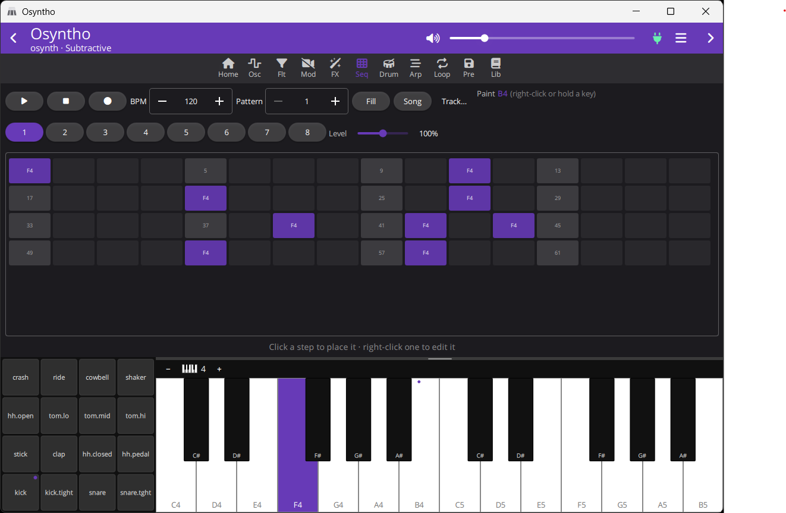

# osynth

**A full groovebox on a microcontroller.** Four synth engines, a real sampled
drum kit, an 8-track multitrack sequencer and an 8-track looper — running on
an ESP32S3 (or ESP32) and played from your phone (or Windows, Mac, Linux) over 
Bluetooth.

```
  4 engines · 8 voices · 12 effects · 8×256-step sequencer
  16-slot drum kit · 8-track looper max 160s · USB audio + MIDI · BLE app
  presets + sequencer + looper persists
```



---

## What it does

### 🎹 Four synth engines, hot-swappable

| Engine | What it is |
| --- | --- |
| **Subtractive** | 2 PolyBLEP oscillators + noise → the filter family below. The classic. |
| **FM** | 2-operator × 2 phase modulation, per-pair index envelopes and feedback. DX-style e-pianos, bells, growling basses. |
| **Wavetable** | 4 morphing table sets × 8 frames × 8 band-limited mips — basic, hard-sync, vocal formants, FM. No aliasing by construction. |
| **Additive** | 16 sine partials with drawbars, spectral tilt, even/odd balance and inharmonicity. A filter sweep with no filter — and now a filter on top of it. |

Switch engines mid-chord — the voice bus fades over ~10 ms, so it never
clicks and never leaves a note stuck.

### 🎛️ One filter family, everywhere

Five topologies — **12 dB SVF**, **24 dB** (Butterworth Q pair, not two
squared stages), **Moog ladder** with saturated feedback, **dual/spread**
(a bandpass whose width is a knob instead of a side effect of Q), and a
**three-formant vowel** filter morphing a–e–i–o–u — across seven responses
(lowpass, bandpass, highpass, notch, peak, allpass, normalized bandpass),
with a **drive** that saturates the resonant integrator rather than just
the output.

All four engines have one. The modular graph gets each heavy topology as
its own node, so the patch budget can price it honestly. And the master FX
bus has one too — the only filter here that reaches the drums and the
looper, which is what makes a whole-track build-up possible. Every one of
them has an on/off switch that skips the work when it is off.

### 🥁 A drum kit that sounds like drums

16 slots of **real recorded percussion**, converted to mu-law at per-slot
sample rates and linked into the firmware as `.rodata` — flash-mapped, so the
whole kit costs **zero RAM**. Per-slot level, pan, tune and decay; choke
groups for hi-hats; a General-MIDI note map. PSRAM boards can load extra kits
from an SD card.

> Every slot picks its own sample rate from measured bandwidth — a floor tom
> carries nothing above 360 Hz, a hi-hat reaches 19.7 kHz.

### 🎛 An actual sequencer, not a toy

**8 tracks × 256 steps × 8 patterns**, each track free to target the synth
engine *or* a drum slot — so one pattern drives both at once.

**Per step** — gate · velocity · probability · micro-timing · 1–8 ratchets ·
trig conditions · accent · slide · parameter locks
**Per track** — length · division · direction · swing · transpose · humanize ·
scale + root

Independent track lengths make **polymeter free**. Trig conditions cover the
`1:4`/`2:4` family plus fill and previous-trig chaining. Parameter locks force
*any* registered parameter for the length of a step and restore it after. The
96 PPQN clock keeps triplets exact and leaves room inside a step for
micro-timing and ratchets — and external MIDI clock is multiplied up into it,
so syncing to a DAW keeps every one of those features.

Plus a song chain, Euclidean fills, and a 4-beat count-in.

### 🔁 8-track looper

Records the master bus, complete with its FX print. IMA-ADPCM in PSRAM at
4:1 — **up to 160 seconds** in mono/4-track mode. Punch-ins land
sample-accurately at the loop start; the other tracks keep playing and never
bleed into the take. Save and load whole loop sets to flash or SD.

A new take can **sync to the sequencer's downbeat** or run a **count-in**
first — on a clock that free-runs, so it works even with the sequencer
stopped.

### ✨ Modulation and FX

- **FX bus:** drive → chorus → flanger → phaser → delay → granular delay →
  reverb → bitcrush → filter → EQ → compressor → stereo/output. Every unit is
  skipped outright while its mix is 0, so the ones you aren't using are free.
- **Compressor with a sidechain key** — glue the whole mix, or duck it off a
  drum slot's trigger for the pumping that a groovebox is bought for. It sits
  late enough in the chain to catch the reverb tail, which is what makes a
  duck read as a duck.
- **Tempo sync** — the delay locks to a note division (1/8, 1/8., 1/8T…) and
  follows an external MIDI clock, not just the internal tempo.
- **2 FX LFOs**, free or locked to anything from 8 bars to 1/32, reaching 27
  destinations across the bus — including tremolo and auto-pan. The per-voice
  mod matrix cannot touch the master bus; this is what does.
- **8-slot mod matrix** — any source to any parameter, evaluated per voice
- 2 LFOs, 2 envelopes, unison with stereo spread, glide, sustain pedal
- **Module gating:** each engine declares the DSP blocks it uses; the rest are
  never allocated or processed
- **Presets:** 16 factory + 64 user slots per engine on LittleFS

### 🔌 Connectivity

- **USB Audio (UAC2) + USB MIDI** as one composite device — record the synth
  straight into a DAW *(ESP32-S3)*
- **BLE control** for the companion app (binary GATT protocol)
- **DIN MIDI in**, a full CC map, **NRPN reaches every parameter**, program
  change selects the engine
- **I2S** to an external DAC, or the classic ESP32's built-in one

---

## 📱 Osyntho — the companion app

A controller app for Android, iOS, Windows, Mac and Linux. It discovers every
parameter at runtime, so it fits whatever firmware you flashed.

- Step-grid sequencer with velocity shading, a live playhead and a full step
  inspector
- Drum mixer with audition pads, plus a **4×4 velocity-sensitive pad grid**
  next to a 2-octave on-screen keyboard
- Curated pages per engine, mod-matrix editor, FX, looper, preset browser
- A patch library stored locally on the app

---

## Quick start

```sh
# once: build the drum kit from a folder of WAV one-shots
python tools/gen_drumkit.py --pack opendrums --out tools/out/drumkit.bin

idf.py set-target esp32s3      # or: esp32, esp32p4
idf.py build flash monitor
```

Plug the S3's native USB port into a computer and it enumerates as an audio
interface *and* a MIDI port. Or pair with the app over BLE. Or wire a DIN
socket and play it from hardware. The heartbeat log line is the health
check — `underruns` should stay at 0.

> The kit step is optional: with no image present the build still links and
> the drum bus is simply silent.

## Three chips, one codebase

| | ESP32-S3 | ESP32-P4 + C6 | classic ESP32 |
| --- | --- | --- | --- |
| USB audio + MIDI | ✅ | ✅ | — *(no USB-OTG)* |
| BLE | ✅ on-die | ✅ *via companion C6* | ✅ on-die |
| Looper | ✅ 8 tracks | ✅ 8 tracks | — *(needs PSRAM)* |
| Sequencer | 8 trk × 8 patterns | 8 trk × 8 patterns | 4 trk × 2 patterns |
| Drum kit | ✅ + SD kits | ✅ + SD kits | ✅ ROM kit |
| Clock | 240 MHz Xtensa | 400 MHz RISC-V | 240 MHz Xtensa |
| Everything else | ✅ | ✅ | ✅ |

The P4 has no radio of its own: BLE runs the NimBLE host on the P4 and its
controller on a companion ESP32-C6 over ESP-Hosted. See
`private_docs/HARDWARE.md`.

Capabilities are derived from the chip: undeclared modules are never compiled in,
and a scaled-down build keeps **every** per-step feature — only the counts shrink.

---

<sub>ESP-IDF v5.3+ · C++17 · ~16k lines of firmware · 48 kHz, 64-sample
blocks, render path in IRAM</sub>

## Donations are welcome

If you liked this software and would like to support its development, you can buy me a coffee. Understand that any value is fine and appreciated, and that your support means a lot to me. Thank you!

[Paypal donation](https://www.paypal.com/donate/?business=NUHKNZCBCPCLQ&no_recurring=0&currency_code=USD)


## Check out my other projects

- [Winzoo](https://github.com/riozebratubo/winzoo): a lightweight taskbar replacement for Windows 10/11
- [qt6appskeleton](https://github.com/riozebratubo/qt6appskeleton): a cross-platform Qt6 app skeleton with sqlite persistence and settings
- [Tilecopy](https://github.com/riozebratubo/tilecopy): a windows local delta file copy tool that supports folders and raw drives
